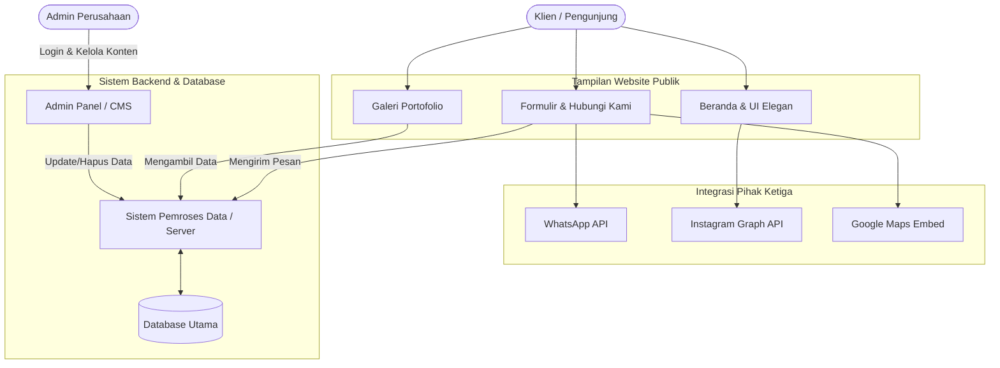
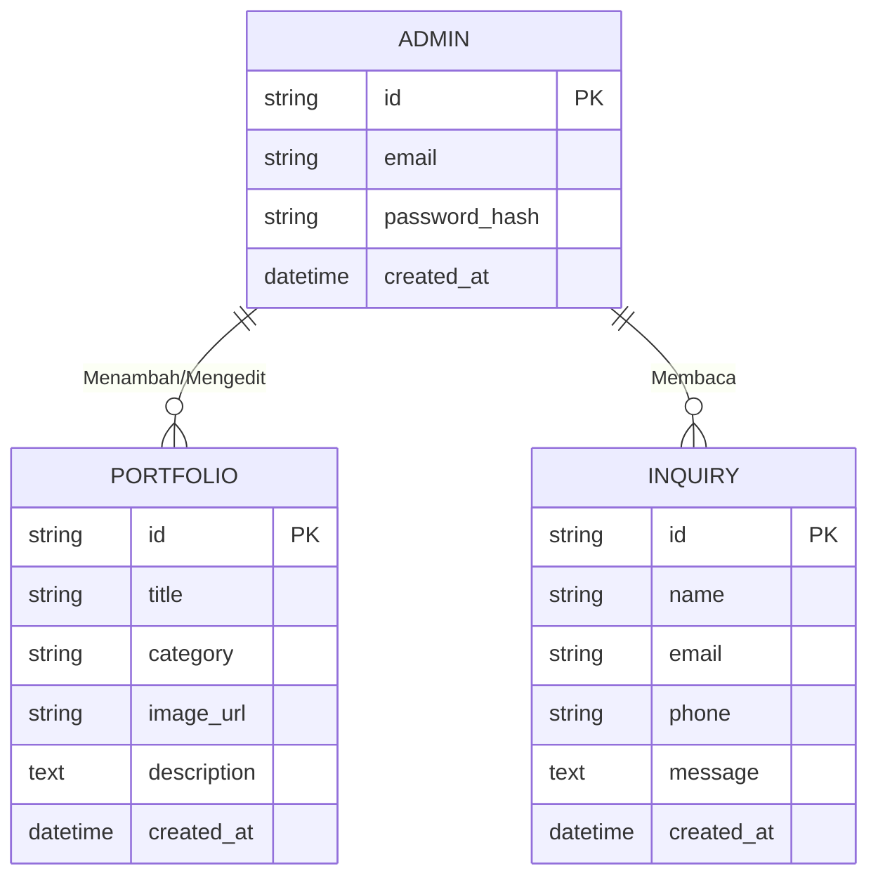

# PRD — Project Requirements Document

## 1. Overview
Proyek ini adalah pembuatan **Website Company Profile** untuk sebuah perusahaan kontraktor bangunan. Tujuan utama dari website ini adalah untuk **Branding Perusahaan** guna membangun kepercayaan dan menarik minat **Klien Perorangan**. Website ini akan menonjolkan kesan profesional, elegan, dan modern melalui penggunaan animasi transisi yang halus, galeri foto proyek berukuran besar, dan tipografi (huruf) yang minimalis. 

Selain sebagai brosur digital yang menampilkan layanan lengkap perusahaan (Arsitektur, Desain Interior, Konstruksi Sipil, dan Developer), website ini juga akan dilengkapi dengan sistem pengelola konten (CMS) agar pemilik bisnis dapat memperbarui foto proyek dan informasi layanan secara mandiri tanpa memerlukan keahlian coding.

## 2. Requirements
- **Target Audiens:** Klien perorangan (pemilik rumah, tanah, atau properti pribadi).
- **Desain & UI/UX:** Mengutamakan estetika modern, elegan, dan bersih (minimalis). Harus memiliki animasi transisi antar halaman/elemen, serta mengedepankan visual foto proyek yang besar dan berkualitas tinggi.
- **Bahasa Utama:** Bahasa Indonesia.
- **Layanan yang Ditawarkan:** Menampilkan informasi "One Service" (Desain, Build, Developer) yang mencakup Arsitektur, Desain Interior, Konstruksi Sipil, dan Developer.
- **Integrasi Pihak Ketiga:** 
  - Tombol Chat WhatsApp langsung agar klien mudah berkonsultasi.
  - Peta Google Maps untuk menunjukkan lokasi kantor fisik.
  - Feed Instagram yang terintegrasi secara dinamis untuk menampilkan update terbaru.
  - Formulir Email untuk pengiriman pesan formal/penawaran.
- **Sistem Pengelolaan Bawaan (CMS):** Sebuah panel khusus (Admin Dashboard) untuk mengunggah foto portofolio baru, mengelola layanan, dan melihat pesan masuk.

## 3. Core Features
**Untuk Pengunjung (Klien Potensial):**
1. **Halaman Beranda (Landing Page) Dinamis:** Area sambutan dengan animasi menarik, teks minimalis, dan ringkasan nilai jual perusahaan.
2. **Halaman Layanan Lengkap:** Penjelasan mendetail mengenai 4 pilar layanan: Arsitektur, Desain Interior, Konstruksi Sipil, dan Developer.
3. **Galeri Portofolio Premium:** Lembar pameran karya dengan sistem grid foto berukuran besar yang interaktif.
4. **Hubungi Kami (Contact Hub):** Halaman kontak yang berisi formulir pengiriman email, lokasi Google Maps, dan tautan langsung ke WhatsApp.
5. **Widget Instagram & WhatsApp:** Ikon WhatsApp yang selalu mengambang di layar (floating button) dan bagian khusus yang menampilkan feed Instagram terbaru.

**Untuk Pemilik Perusahaan (Admin CMS):**
1. **Login Aman:** Sistem masuk khusus admin untuk menjaga keamanan data.
2. **Manajemen Portofolio (CRUD):** Fitur untuk menambah, mengedit, dan menghapus foto serta detail proyek kontraktor.
3. **Manajemen Pesan:** Kotak masuk sederhana di dalam dashboard untuk melihat pesan yang dikirim pengunjung melalui formulir website.

## 4. User Flow
**Perjalanan Klien (Pengunjung):**
1. Klien membuka website dan disambut oleh animasi transisi serta deretan foto bangunan yang elegan.
2. Klien membaca bagian "Layanan" untuk memastikan perusahaan ini menyediakan jasa yang mereka butuhkan (misal: Desain Interior).
3. Klien membuka halaman "Portofolio" untuk melihat hasil kerja sebelumnya guna membangun rasa percaya.
4. Klien tertarik dan menekan tombol WhatsApp atau mengisi Formulir Email untuk berkonsultasi lebih lanjut.

**Perjalanan Admin (Pemilik/Staf):**
1. Admin mengakses URL khusus (contoh: `website.com/admin`) dan melakukan login.
2. Admin masuk ke Dashboard utama.
3. Admin memilih menu "Portofolio", lalu mengunggah foto proyek terbaru yang baru saja selesai dibangun, memberikan judul, dan menyimpannya.
4. Proyek baru tersebut otomatis muncul di halaman Galeri publik.

## 5. Architecture
Sistem ini menggunakan arsitektur web modern (Full-stack) di mana tampilan depan (website publik) dan sistem belakang (CMS Admin & Database) dibangun di dalam satu ekosistem yang seragam. Ini membuat website lebih cepat dimuat, aman, dan ramah mesin pencari (SEO).

## 6. Database Schema
Untuk mendukung fitur website dan CMS, database akan menyimpan data pengguna admin, proyek portofolio, dan pesan yang masuk.

**Daftar Tabel (Koleksi Data):**
1. **Admin (Pengelola):** Menyimpan data otentikasi pemilik/staf.
   - `id` (String): ID unik admin.
   - `email` (String): Alamat email untuk login.
   - `password_hash` (String): Kata sandi yang dienkripsi aman.
2. **Portfolio (Proyek):** Menyimpan data detail bangunan/pekerjaan.
   - `id` (String): ID unik proyek.
   - `title` (String): Nama proyek (misal: "Renovasi Villa Bali").
   - `category` (String): Kategori layanan (Arsitektur, Interior, dll).
   - `image_url` (String): Link lokasi penyimpanan foto besar proyek.
   - `description` (Text): Penjelasan singkat mengenai proyek.
   - `created_at` (Date): Tanggal proyek diunggah.
3. **Inquiry (Pesan Klien):** Menyimpan pesan dari Formulir Email.
   - `id` (String): ID unik pesan.
   - `name` (String): Nama klien.
   - `email` (String): Email kontak klien.
   - `phone` (String): Nomor telepon/WA klien.
   - `message` (Text): Isi pesan/pertanyaan.
   - `created_at` (Date): Waktu pesan dikirim.

## 7. Tech Stack
Berikut adalah rekomendasi teknologi terbaik yang dipilih (sesuai standar industri modern) untuk menciptakan website yang super cepat, stabil, mudah dikelola, dan mampu menghasilkan animasi yang mulus:

- **Frontend (Tampilan Depan):** 
  - **Next.js:** Fondasi utama kerangka kerja website. Sangat baik untuk kecepatan (Performa) dan SEO.
  - **Tailwind CSS:** Alat untuk membuat gaya (desain) dengan cepat dan rapi.
  - **shadcn/ui:** Kumpulan komponen siap pakai untuk menghasilkan antarmuka modern dan minimalis.
  - **Framer Motion:** *Tambahan khusus* untuk menghasilkan animasi transisi yang elegan dan profesional sesuai permintaan asli.
- **Backend (Logika Sistem & Server):** Next.js Server Actions (Menyatu dengan Frontend agar pengembangan lebih cepat dan hemat biaya).
- **Database Utama:** **SQLite** (Super ringan, sangat cocok untuk Company Profile yang tidak memproses jutaan transaksi per detik).
- **ORM (Penghubung Database):** **Drizzle ORM** (Modern, cepat, dan aman).
- **Otentikasi (Sistem Login):** **Better Auth** (Sistem login yang sangat aman untuk melindungi CMS Admin).
- **Deployment (Server Hosting):** **Vercel** (Optimal untuk Next.js, membuat website dapat diakses secara online dengan stabilitas tinggi).